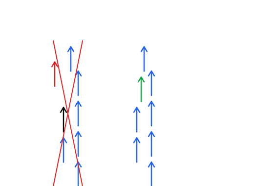
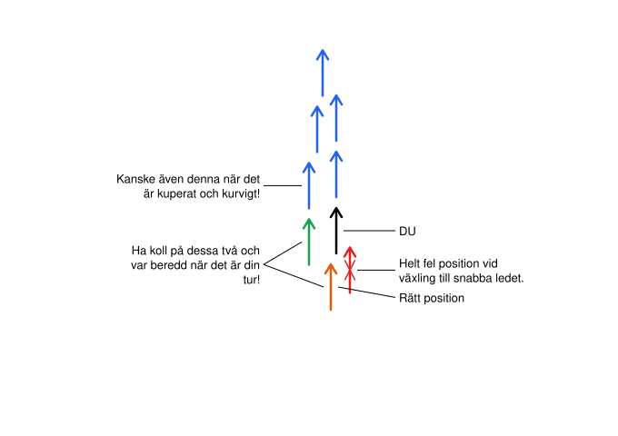

> **Version 0.6 (2026-05-06).** Levande dokument under iteration. Kommentera fritt.
>
> **Tonen:** Vi förklarar *varför* — inte bara vad. Reglerna är till för säkerhet, samlad grupp och energieffektivitet. När verkligheten avviker från reglerna — använd omdöme, prioritera i den ordningen.

---

## §1 Vad denna handbok är till för

Den här handboken samlar grunderna för att cykla i klunga under ett långlopp. Den beskriver hur vi formar oss, kommunicerar, hanterar backar och omkörningar, och vad varje person behöver kunna för att klungan ska fungera.

Den är **medvetet generisk**. Den säger inget om ett specifikt lopp, en specifik klubb eller en specifik grupp — den beskriver tekniker och principer som gäller för klungcykling allmänt. Lopp- och gruppspecifika beslut (tider, depåstrategi, vad gör vi om någon punkterar, vilka roller vi har) hör hemma i ett separat *kravdokument* för respektive grupp.

Läs den här handboken **före** kravdokumentet. Då har du språket och förståelsen som krävs för att förstå vad gruppen kommit överens om.

---

## §2 Klung-grunder — varför vi cyklar i klunga

När du cyklar ensam möter du fullt vindmotstånd. När du ligger bakom någon annan ligger du i lä — du kan spara 20–30% energi genom att inte ligga först. Klungcykling är hela gruppen som turas om att ta vinden, så att alla får både dra och vila.

Tre saker måste hända samtidigt för att en klunga ska fungera:

1. **Säkerhet** — ingen krockar. Detta vinner alltid över allt annat.
2. **Samlad grupp** — gruppen håller ihop. En spridd klunga är ineffektiv och farlig.
3. **Energieffektivitet** — vi turas om att dra, varje förning är kort, vi sparar krafter.

Allt vi gör — formationen, signalerna, hur vi tar uppförsbackar — är till för att uppfylla dessa tre. När du står inför ett oklart läge, prioritera i den ordningen: säkerhet > samlad grupp > energi.

**Tänk diesel-lok.** En väl fungerande klunga rullar fram som ett samlat tåg — jämn rytm, ingen stress, lugn och fin. Var och en bidrar till flytet genom att inte skapa rycker. Det är gruppens samlade energi som bär oss till mål, inte enskilda hjältedåd. Gör det bekvämt för cyklisten bakom dig: håll farten, håll linjen, håll avståndet. Uppstår lucka — ta igen långsamt, bidra inte till stress.

---

## §3 Formation

Det finns flera olika formationer en klunga kan köra i. Valet styrs av tre saker:

- **Vindförhållanden** — sid-/kantvind, motvind, medvind eller stilla
- **Gruppstorlek** — vissa formationer kräver ett visst antal förare för att fungera
- **Styrkefördelning** — vissa formationer förutsätter att alla är ungefär lika starka, andra hanterar olikheter bättre

Gruppen kan **röra sig mellan formationer under passet**. Att växla görs typiskt på beslut av kapten eller farthållare när förhållanden ändras (vindkast, en backig sektion, någon tröttnar). Beslutet om vem som tar växlingsbesluten är gruppspecifikt och hör hemma i gruppens kravdokument.

Formationerna som beskrivs här:

- **§3.1 Tvåpar** — två led i samma fart, individuell rotation
- **§3.2 Belgisk kedja** — två led med konstant fartskillnad, kontinuerligt flöde
- **§3.3 Lagtempo** — ett enda led, rotation runt linjen, förningstider efter förmåga

Vid trånga vägar eller omkörningar kan gruppen tillfälligt komprimera till ett enda led (utan rotation) — beskrivs i §3.1 i samband med tvåpar.

**Generella principer som gäller alla formationer:**

- **Långsamma fartökningar och fartsänkningar.** Aldrig snabba. Om du måste justera fart, gör det så långsamt att gruppen knappt märker det. Detta gäller i alla formationer.
- **Rotation åt vindsidan.** När det blåser vill man rotera så att den som driver bakåt också tar vinden — så den som ligger i lä får verklig vila. I belgisk är detta inbyggt i mekaniken; i tvåpar och lagtempo väljs riktningen aktivt efter vindriktning.
- **Klungkörning i backar.** Rotation pausas i uppförs- och nedförsbackar — beskrivs i §6, gäller alla formationer.

### §3.1 Tvåpar

Två led bredvid varandra — **båda leden i samma fart**. Det finns inget "snabbt" eller "långsamt" led i tvåpar i steady state; båda är jämbördiga och rullar i grupptempot. Rotation sker genom att den som ligger längst fram glider av åt sin sida och driver tillbaka längs **utsidan** av sin kolumn. Resten av kolumnen rullar fram en plats, och en ny förare hamnar längst fram.

**Förning** — tiden längst fram — är kort, men exakt hur kort beror på gruppens fart och form. Längre pulls bygger trötthet och berövar någon längst bak chansen att komma fram för att äta/dricka. Den enskilda gruppens kravdokument anger riktvärdet.

**Princip — inga rycker, bara små justeringar:**

- Vi accelererar **inte** in i ledningen och bromsar **inte** när vi glider av
- Vid rotation: bara små farsänkningar (typiskt 0,5–1 km/h) på den som lämnar ledningen; den som tar över **behåller** farten
- Den som tar över har redan rätt fart innan hen ligger först — du *möter* tempot bakifrån, du börjar inte trampa hårdare när du blir först
- Behåll kadens — växla ner ett steg när farten naturligt sjunker (du som driver bakåt utanför kolumnen)

**Varför inga rycker:** Små fartökningar i täten amplifieras ner i ledet. Om person 1 ökar 1 km/h måste person 2 öka ~1,5 km/h för att stänga luckan; person 3 ~2 km/h, och så vidare. Detta är **dragspelseffekten** — den som drar i sin förning utan att tänka på det river upp gruppens samordning och slukar energi. Bra rotation är så jämn att en utomstående knappt märker att gruppen byter förare.

**Håll ihop paren — och håll ihop kolumnen.**
Tätt mellan paren längdleds är minst lika viktigt som tätt sidleds. Är det en stor lucka framför ett par så får det paret också möta vind, även om de tror att de ligger i lä. Hela kolumnen ska vara så pass tight att den första personens lä sträcker sig hela vägen ner i leden. Detta är hur tvåpar är energi-snålt — alla får skydd, inte bara halva gruppen.

> [BILD-PLATS §3.1: Tvåpar-formation — två kolumner i samma fart, rotation via utsidan.]

**För- och nackdelar med tvåpar:**

| Pro | Con |
|---|---|
| Lugn, standardformation — lätt att lära | Vid sid-/kantvind dåligt — vinden träffar båda leden ungefär lika |
| Plats för par-prat sidleds, ger social rytm | Förutsätter att förarna är **ungefär lika starka** — annars blir rotationstakten ojämn |
| Funkar bra med gruppstorlek från ~6 och uppåt | Lägre snittfart än belgisk vid samma ansträngning |
| Litet manöverutrymme behövs vid rotation | |

**Tillfällig ettled — gå ner till ett led**

Ibland blir vägen för smal för tvåpar — vid omkörning av en större klunga, mötesfordon på smal väg, vid hinder eller refug. Då går gruppen ner till ett enda led, utan rotation, tills det är säkert att gå tillbaka.

*Att gå ner — blixtlås-modellen:*

- De båda leden flätas ihop till ett, varannan från vänster och höger sida
- Den som ligger fram-höger sjunker in bakom fram-vänster, person 2 i höger sjunker in bakom person 2 i vänster, och så vidare
- Vilket led som tar förstaplatsen är överenskommet i förväg eller signaleras i stunden
- **Mjukt — inga fartökningar, inga bromsningar.** Försök hålla din fart genom in-flätningen; det är bara position som ändras

*Under ettled:*

- **Rotation pausas.** Alla håller sin position tills gruppen är tillbaka i tvåpar.
- Gruppen är nu fysiskt **dubbelt så lång** — eka hinder, fordon, signaler extra noga
- Håll farten — sänk inte bara för att det "känns" långsammare i en lång rad

*Att gå tillbaka — samma blixtlås:*

- Vägen tillåter — gruppen breddas igen genom att varannan glider åt sidan
- Vänta på "**Kontakt!**" från siste man innan rotationen tar vid igen
- Behåll farten under övergången — luckor som uppstår tas igen lugnt, inte med ryck

Samma princip gäller om gruppen behöver komprimera från belgisk eller lagtempo — blixtlås in, vänta, blixtlås ut.

### §3.2 Belgisk kedja

Belgisk kedja är effektiv vid sid-/kantvind men används också för högfartspass på slätt.

**Grundprincipen — konstant fartskillnad:**

Två led, men de går **inte** i samma fart. Det ena ledet (det snabba) går några km/h snabbare än det andra (det långsamma). Skillnaden är **konstant** — inte en rotationshändelse var 30:e sekund som i tvåpar, utan ett ständigt flöde där snabba ledet kontinuerligt rullar förbi det långsamma.

- **Långsamma ledet tar vinden.** Det är där det riktiga jobbet görs.
- **Snabba ledet ligger i lä av det långsamma** — det får skydd från vinden men kommer ändå framåt snabbare i absoluta tal eftersom det inte möter vindmotstånd.
- Du går "varv" runt kedjan: jobbar i långsamma ledet en stund, glider över till snabba ledet i lä, rullar fram, glider över till långsamma ledet igen i täten, börjar om.

**Vid sid-/kantvind:**

| Vindriktning | Långsamma ledet (vindsida) | Snabba ledet (lä) |
|---|---|---|
| Vind från vänster | Vänster | Höger |
| Vind från höger | Höger | Vänster |

**Övergången från snabba till långsamma ledet — inte släppa kraften:**

När du går från snabba till långsamma ledet är det lätt att tänka "nu får jag vila". **Det är fel.** Långsamma ledet är där det jobbas — du ska bara minska farten med den lilla skillnaden mellan leden (en eller ett par km/h), inte din effekt. Trycket på pedalerna håller du.

Detta är den vanligaste tabben i belgisk: någon kommer in i långsamma ledet och släpper av för mycket — en lucka uppstår, eller hela ledet bromsar för att inte köra ifatt. Det river upp kedjan.

**Inga rycker. Inga bromsningar. Inga luckor.**

Varje övergång ska vara så jämn att den nästan inte syns. Långsamma accelerationer och deaccelerationer — aldrig snabba. Om du måste justera farten, gör det så långsamt att gruppen knappt märker det.

**Snabbare rotation än i tvåpar:**

I belgisk är förningarna mycket kortare än i tvåpar — du befinner dig kort tid längst fram i långsamma ledet (där du tar full vind) och fortsätter sen runt. Vid kantvind är detta extra viktigt: vindsidan tar all vind, och om rotationen är för långsam blir halva klungan utsliten utan att andra halvan tar någon vind värd att tala om. Snabb rotation = vinden delas jämnt.

> [BILD-PLATS §3.2: Belgisk kedja — pilar som visar två led med fartskillnad och rotationsflöde.]

**Sakerheter att ha med sig:**

- Längst fram i långsamma ledet är du **ansvarig för farten** — sänk inte effekten, alla bakom dig är beroende av att du jobbar på
- Aero-aspekt: en cyklist utan lä bakom gruppen kan möta flera gånger större luftmotstånd än en i fullt skydd — så formationens disciplin avgör om gruppen håller ihop alls

**För- och nackdelar med belgisk:**

| Pro | Con |
|---|---|
| Bäst i klassen vid sid-/kantvind | Förutsätter att alla förare är **ungefär lika starka** — det konstanta fartdifferentialet kräver att alla kan hålla farten på vindsidan |
| Ger högst snittfart vid samma ansträngning | Kräver ett **antal förare** för att flödet ska fungera — typiskt 8 eller fler. Med färre blir rotationen för kort och otydlig |
| Energin delas jämnt över hela gruppen | Tekniskt mer krävande än tvåpar — kräver övning |
| | Större manöverutrymme behövs på vägbanan |

### §3.3 Lagtempo

Lagtempo (single-line rotation; *team time trial*-formation) är **ett enda led** där cyklisterna roterar runt linjen. Den som ligger först tar sin förning, glider av åt sidan, driver tillbaka längs utsidan av ledet, och går in sist. Vanligt vid intervallpass och i lagtempotävlingar.

**Mekaniken:**

- En lång rad — alla cyklister bakom varandra
- Den som ligger först drar tills hen är klar med sin förning
- När hen släpper går hen åt sidan (typiskt åt vindsidan om det blåser, annars åt valfri sida som överenskommet) och driver bakåt med en liten farsänkning
- Person 2 blir ny förare — behåller farten
- Den som driver bakåt går in sist i ledet
- Kontinuerligt flöde — som en gångbana som rör sig

**Förningar efter förmåga.** Olikt tvåpar och belgisk där alla i grunden tar lika långa pulls, anpassas pulserna i lagtempo efter styrka:

- **Stark cyklist:** drar längre, kanske 1–2 minuter
- **Svagare cyklist:** drar kortare, kanske 15–30 sekunder
- Var och en gör sitt och gruppen kommer fram tillsammans

> [BILD-PLATS §3.3: Lagtempo-formation — en linje, rotation runt utsidan.]

**För- och nackdelar med lagtempo:**

| Pro | Con |
|---|---|
| Funkar med **få förare** — fungerar redan från 2–3 cyklister, optimalt vid 3–6 | Endast en cyklist i taget tar vinden — ingen parallell lä-position |
| Tolererar **styrkeskillnader** — pulserna skalas efter förmåga | Vid kraftig sidvind sämre än belgisk eftersom det inte finns något lä-led |
| Lugn formation, lätt att lära | Lägre snittfart än belgisk när belgisk är möjlig |
| Vanlig på intervallpass och i mindre grupper | |

**Vinge — lagtempo i sidvind**

Vid sidvind kan lagtempo formera sig som en *vinge* (echelon-i-miniatyr): ledet ligger snett över vägen istället för rakt på, så cyklisterna bakom kan ligga i lä av framförvarande. Den som rotateras av glider bakåt på **vindsidan** — där tar man vinden själv som "långsamma ledet" i miniatyr. Den som ligger längst bak och håller på att gå runt blir alltså den enda som möter full vind. Det här är lagtempo-versionen av belgisk-principen, men anpassad för få förare.

---

## §4 Kommunikation och signaler

I en klunga ser de framför inte vad som händer bakom, och de bakom ser inte vad som händer framför. Därför **eka alla signaler**. Det är allas ansvar att föra signalen vidare — om du tar emot ett kommando, för det vidare.

### §4.1 Röstkommandon

| Kommando | Betydelse | Vem ropar |
|---|---|---|
| **Håll igen!** | Lucka i ledet — först man tar det lugnt. (Vi använder *inte* "Lucka!" — för likt Punka, Olycka, Öka.) | Den som ser luckan |
| **Kontakt!** | Alla är med. Skickas framåt från siste man eller grindvakt. | Sist i ledet |
| **Alla med?** | Fråga om alla är med (typiskt efter krön/sväng). Skickas bakåt. Svar är "Kontakt!" eller "Håll igen!". | Vem som helst i täten |
| **Punka!** | Punktering — gruppens beslut hur vi hanterar (se gruppens kravdokument). | Den som punkterar |
| **Olycka!** | Stannar gruppen så säkert som möjligt. | Den som ser olyckan |
| **Lås kedjan!** | Slut på rotation, alla håller sin position. | Kapten/farthållare |
| **Öka 1 / Öka 2** | Höj farten med 1 km/h respektive 2 km/h. | Kapten/farthållare |
| **Sänk 1 / Sänk 2** | Sänk farten med 1 km/h respektive 2 km/h. | Kapten/farthållare |
| **Bil!** | Fordon framifrån. | Den som ser |
| **Bil bakom!** | Fordon bakifrån. | Den som ser |
| **Stanna!** | Vi stannar. Eka. | Kapten/grindvakt |
| **Klart!** | Sista cyklisten har passerat omkörd grupp — vi kan vika in. | Sist i omkörningen |

### §4.2 Handsignaler

Använd handsignaler **alltid** — även om du är trött. Längre bak ser man inte vad som händer fram.

| Signal | Hur |
|---|---|
| **Stanna** | Uppåtsträckt hand |
| **Sakta ner** | Pumprörelse, handflatan nedåt vägbanan |
| **Hinder höger** | Vinka med höger hand bakom ryggen åt vänster, eller klappa dig på rumpan |
| **Hinder vänster** | Vinka med vänster hand bakom ryggen åt höger, eller klappa dig på rumpan |
| **Hinder på vägbanan** (hål, brunn, glas) | Peka ner mot vägbanan med samma sida som hindret |
| **Sväng** | Vanliga svängtecknet (utsträckt arm) |
| **Lås kedjan** | Uppåtsträckt knuten hand |

### §4.3 Princip för kommunikation

- **Eka alltid.** Om du hör en signal, för den vidare. Annars kommer den inte hela vägen.
- **Mer hellre än mindre.** Bättre att signalera en gång för mycket än att någon kör i ett hål.
- **Lugn ton.** Inga onödiga skrik — det skapar oro och kan misstolkas.
- **Konstruktiv återkoppling under färd.** Om någon kör in för nära, säg det. Vänta inte tills passet är slut.

---

## §5 Rotation och förning

Förningen — tiden du ligger längst fram och tar vinden — är kort. Exakt längd beror på formation, gruppens fart och styrkebalansen i gruppen, och fastställs av varje grupp för sig (se gruppens kravdokument). Det är sällan smart att dra längre än överenskommet även om du känner dig stark:

- Någon längst bak kan vänta på att få ligga sist för att dricka eller vila
- En stark förning varv efter varv åt samma håll bygger en obalans i klungan
- Svaga ben kan inte hänga med om förningen blir för lång

### §5.1 Att släppa förningen (kliva av i täten)

När det är din tur att kliva av:

1. Behåll **samma kadens** — ingen acceleration, ingen broms
2. Glid mjukt åt din sida — utanför kolumnen, inte över i andra ledet
3. Driver bakåt längs **utsidan** av din kolumn med endast en liten farsänkning (0,5–1 km/h)
4. Vid bakkant av kolumnen — glid in på sista platsen
5. Du bromsar inte. Du driver bara aningen långsammare en kort stund.

### §5.2 Att bli ny i täten

När det är din tur att gå fram:

1. Du är redan i kolumnen och rullar med — du behöver inte accelerera
2. När personen framför dig glider av blir du automatiskt först
3. **Behåll farten** — ingen acceleration, inget extra tryck för att "visa"
4. Det är gruppens fart som gäller, inte din egen ambition

**Position i kolumnen är viktig.** Memorera 2–3 cyklister framför dig så vet du när det är din tur. Skapa **inte** ett "tredje led" genom att gå ut åt sidan för tidigt — det stör flytet och bygger luckor som hela ledet får ta igen.

*Vid rotation fram: den röda pilen har gått ut för tidigt och skapat ett tredje led — det ger lucka för cyklisten bakom (svart) som får ta vind längre än nödvändigt. Den gröna pilen ligger kvar tätt bakom — rätt position. Principen gäller både tvåpar och belgisk kedja.*

*Vid rotation bak: du (svart) ligger i ledet och håller koll på de två bakom dig (orange och grön) — det är så du vet när det är din tur. Den orangea pilen är rätt slot; den röda pilen med kryss är samma "tredje ledet"-fel mot bakkanten.*

### §5.3 Anpassa förningen efter form

Förningar är inte rättvisa — de är efter förmåga.

- **Är du stark just nu?** Dra gärna lite längre. Dina extra sekunder gör att någon längre bak hinner äta, dricka, eller bara återhämta.
- **Är du trött?** Rotera in tidigare — du behöver inte gå ända fram i ledet. Glid över till nästa led några positioner bakom täten, så går du runt kortare. Ingen kommer hålla det emot dig.
- **Helt slut?** Lägg dig bakom grindvakten ("café-vagnen", §11). Drick, ät, kom tillbaka när du är pigg.

Detta gäller i både tvåpar och belgisk. Principen är: **gruppens samlade energi**, inte enskilda hjältedåd. En grupp där alla justerar efter form håller ihop bättre och rullar i mål snabbare än en grupp där alla försöker dra lika mycket.

### §5.4 Om luckor uppstår

En lucka är inte automatiskt ett krismoment. Ta igen den lugnt:

- Räkna med **4–5 sekunder per meter** lucka
- Inga toktryck — det stör hela ledet och slukar gruppens energi
- Bättre att en person bryter vinden lite längre än att fem gör det när de ska köra ikapp
- **Bidra inte till stress och ryck.** Den som tar igen luckor med ryck flyttar bara stressen ett varv ner i ledet.

Om du upprepat skapar luckor på din förning — gå **bakom grindvakten**, drick, ät, kom tillbaka när du återhämtat. Att kämpa kvar med tomma ben gör att klungan totalt sett tappar mer energi än den vinner.

---

## §6 Backar

**Princip — vi når inte målet i backarna.** Backarna är så liten del av loppet att vinsten av att köra hårt är försumbar. Men förlusten är stor: gruppen sprider sig, de bakre måste spurta ifatt, och de bästa benen är sönder när det är dags att rotera på slätt igen. Spara energin för där den betalar tillbaka.

### §6.1 Uppförsbackar — löjligt lugnt

Långsamt och samlat. Vi tar det **löjligt lugnt** uppför. Det är medvetet och det är rätt — pressar gruppen i backen blir alla slitna till ingen nytta.

**Före backen — tryck till in:**
Den som ligger först ökar trycket lite redan **innan** backens fot. Då hinner hela gruppen in i backen innan farten naturligt sjunker. Resultatet: farten sänks av backen själv (gravitation + lutning), inte av att täten bromsar — och de bakre slipper bromsa för att inte köra ifatt. Att gå in samlat är halva trick'et med uppförsbackar.

**I backen:**

- Lås kedjan (rotation pausas)
- Den som ligger först trycker mjukt så att de bakom inte måste bromsa
- Behåll jämn ansträngning — sprintar du tappar gruppen
- Ställ dig inte upp i onödan — när du gör det går cykeln 10–30 cm bakåt vilket riskerar krock. Om du måste, förvarna och ställ dig upp **mjukt med fortsatt tryck**

**På krönet — vänta in alla:**
Lika viktigt som att gå **in** samlat är att gå **ut** samlat. Vänta tills **hela gruppen är över krönet** innan farten höjs. Annars måste de bakre — ofta de mest trötta — spurta ifatt, och det är slöseri på precis de personer som har minst kvar att ge. Kommando: "**Alla med?**" framifrån — svar "**Kontakt!**" eller "**Håll igen!**" bakifrån.

### §6.2 Nedförsbackar — löjligt hårt

Spegelbilden av uppförsbacken. **De som ligger längst fram trampar på** — annars förlorar gruppen fart, eftersom de bakom tar lä och inte behöver pedalera lika mycket. När täten bromsar (även lite) blir det en avvägning för bakre delen — i värsta fall behöver några bromsa, vilket är onödigt energislöseri.

**Princip — kör löjligt hårt utför:** Täten ska trycka på så hårt att ingen bakom *behöver* bromsa. Mjukt och jämnt — inga ryck eller sprintar — men en god effekt på pedalerna. Behåll linjen.

**Två viktiga undantag:**

- **Vid kantvind** — om det blåser kraftigt från sidan i nedförsbacken, kör inte hårt. Du har redan en sårbar formation (§3.2) att hantera, och hög fart i kantvind är farligt. Lugnare och säkrare här.
- **Om dina ben tar slut i täten** — **rotera fortare** istället för att försöka muska igenom. Är dina ben slut, glid av tidigare och låt nästa par ta över med fräscha ben. Bättre att fyra personer drar tre korta pulls än att två tröttar ut sig på två långa. Detta är hela poängen med rotation: att utnyttja gruppens samlade energi, inte enskildas.

**Säkerhetsmarginal:** I nedförsbackar är reaktionstiden viktigare än i medvind. Lite längre avstånd är OK om det känns osäkert.

---

## §7 Omkörning av andra grupper

Andra klungor och ensamma cyklister kommer dyka upp framför oss. Två lägen:

### §7.1 Vi kör om en klunga

- **Lägg om till ett led** vid behov
- **Ligg kvar i omkörningsfilen tills hela vår klunga är förbi** — gruppen är ofta dubbelt så lång som du tror
- Vänta på "**Klart!**" från siste cyklist innan du viker in
- Vik **inte** in framför dem vi kör om — det suger in dem i vårt kölvatten och stör båda grupperna

### §7.2 Vi kör om enskilda cyklister

- Kan ofta göras i tvåpar
- Den som ligger först-höger avgör hur omkörningen utförs
- Visa respekt — många omkörda är ovana cyklister. Undvik "Håll höger" — använd "Kommer vänster!" eller liknande. Heja gärna och säg tack.

---

## §8 Säkerhet

**Säkerhet är alltid nummer ett.** Före tid, före energi, före allt annat.

- **Marginal till framförvarande hjul** — alltid en liten lucka, så du har reaktionstid
- **Halv-hjul** är situationsberoende:
  - **I tvåpar och i ettled:** ligg rakt bakom framförvarande, **inget halv-hjul**. Halv-hjul är farligt här — om personen framför svänger eller bromsar har du noll marginal.
  - **I belgisk:** halv-hjul är formationens grund — cyklisterna ligger snett efter varandra för att få lä. Disciplin krävs.
  - **I lagtempo (vinge):** halv-hjul åt vindsidan när formationen är spridd som vinge.
- **Håll linjen** — gå inte ut ur led för att bromsa via vindmotståndet. Det gör leden otydliga och är olycksrisk.
- **Visa tecken och eka kommandon** — även när du är trött
- **Drick och ät där det är säkert** — bakom grindvakten, eller (i belgisk) i långsamma ledet. Aldrig på en plats där fingrandet stör flytet.
- **Två flaskor i ramen, inga flaskor bakom sadeln** — sadelflaskhållare är säkerhetsrisk (flaskor lossnar)
- **Ställ dig inte upp utan förvarning**

### §8.1 Vid olycka

Hela gruppen stannar till. Lämna olycksplatsen åt de som har som uppgift att ta hand om det (se gruppens kravdokument — där beslutas vilka som stannar). Resterande grupp formerar sig på vänster sida av vägen, så långt mot kanten som möjligt, i ordnad form. När läget är klart fortsätter gruppen i ordnade former.

---

## §9 Energi och vätska

### §9.1 Princip

Du brinner cirka **600 kcal/timme** i klungkörning, varav ~60 g kolhydrater. Räkna och planera.

- **Ät kontinuerligt** — typiskt var 30:e minut, redan från början. Vänta inte tills hungern slår till.
- **Drick kontinuerligt** — typiskt var 15:e minut.
- **Träna med samma mat du ska äta på loppet.** Ditt magsystem ska känna igen det.

### §9.2 Praktiska tips

- **Förbered i förväg.** Öppna geler/bars med kork, dela upp i portionsbitar före start. Det är svårt att fingra med förpackningar i fart.
- **Energikakor i ramväska eller ryggficka** — inte i händerna. Snickers fungerar bra om man köper portionsbitar i lösgodis.
- **Två flaskor i ramen.** Behöver du mer — extra flaska i ryggfickan. Inte sadelflaskhållare.
- **Ät där det är säkert** — bakom grindvakten, eller (i belgisk) i långsamma ledet. Aldrig på en plats där fingrandet drar uppmärksamhet.

### §9.3 Exempel-energiplan

Detta är ett *exempel* — anpassa till din kropp och ditt loppupplägg.

| Tid | Vad |
|---|---|
| 30 min före start | Frukost klar — gröt, banan, kaffe |
| Start–2h | Energibar var 30:e min, vatten/sportdryck var 15:e min |
| 2h–4h | Skifta till geler eller dadlar för snabbare upptag |
| 4h–slut | Vad du orkar tugga — energibars, dadlar, smörgås med honung/marmelad, chokladbit. Salt om varmt. |

**Välj kalorität energi per volym/vikt** — du har begränsat utrymme i ryggfickan. Energibars, geler, dadlar och chokladbitar ger mycket energi i lite utrymme. Riskaka och bröd är mer skrymmande per kalori — de fungerar men ta hellre med några bitar smörgås med pålägg än stora riskakor.

Mer detaljerade exempel kan finnas som separat dokument i den enskilda gruppens material.

---

## §10 Material

- **Servad cykel** — gör eventuell service flera veckor före loppet, så att du hinner provköra
- **Fräscha däck och nya slangar** — minskar punkteringsrisk avsevärt. Provkör nya däck några mil innan.
- **Inga flaskhållare bakom sadeln** — säkerhetsrisk
- **Inga däckbyten eller justeringar dagen innan utan att provköra**

---

## §11 Drop-strategi (att lägga någon trött bakom grindvakt)

Det här är ett *koncept* — gruppen bestämmer detaljerna i sitt kravdokument.

**Idén:** Den som är slut, har tomma ben, eller behöver äta/dricka i lugn och ro lägger sig bakom grindvakten. Där är man inte med i rotationen — man "vilar" och behöver inte ta vind. Vissa grupper kallar denna position **"café-vagnen"** eller "grindvakten-läget".

**Varför det funkar:**

- En cyklist som kämpar med tomma ben och skapar luckor varv efter varv kostar gruppen mer energi än om hen vilar och kommer tillbaka
- Bakom grindvakten är man fortfarande i klungans skydd — man cyklar kortare, lättare, hänger ihop
- Man kan komma tillbaka in i rotationen när krafterna återvänt

**När man "släpps":** Om en cyklist inte kan hålla farten ens bakom grindvakten — då måste gruppen ta ett beslut. Detta är gruppspecifikt och bör beslutas före passet (se gruppens kravdokument).

**Princip:** Det är ingen skam att åka café-vagnen. Hellre ta sig till mål än att kämpa till krasch eller hålla upp gruppen.

---

## §12 Klung-skola — vanliga misstag

Ofta gjorda av nybörjare i klunga (klassiker-typer som inte cyklat klunga förut är vanlig publik):

| Misstag | Varför fel | Lös istället |
|---|---|---|
| Ökar farten när man drar fram | Skapar dragspelseffekt längre bak; sliter hela gruppen | Behåll farten — bara hålla ut den |
| Skapar tredje led genom att gå ut tidigt vid övergång | Bygger lucka, stör flytet | Vänta tills det är din tur |
| Tar igen lucka med ett ryck | Ger upphov till accordion-effekt 10 cyklister bak | Ta igen lugnt, 4–5 sek/meter |
| Drar 2 minuter när man känner sig stark | Stör schemat, och någon längst bak väntar på att få komma fram | 30–60 sek max |
| Cyklar kvar med tomma ben | Skapar luckor varv efter varv, gruppen tappar energi | Bakom grindvakt, drick/ät, kom tillbaka pigg |
| Bromsar genom att gå ur led | Otydlighet, olycksrisk | Bromsa diskret med trycket på pedalerna eller signalera ned |
| Stora flaskor bak på sadeln | Ramlar av i farten | Två flaskor i ramen + ev. ryggficka |
| Ställer sig upp utan förvarning | Cykeln går 10–30 cm bakåt → krock | Förvarna; ställ dig upp mjukt |
| Skär kurvor | Du tar någon annans linje | Håll din linje, även om det betyder lite extra meter |

---

## §13 Begreppslista

- **Förning** — den tid du ligger längst fram i ett led och tar vinden
- **Grindvakt** — bakvakt; sista cyklisten i en klunga som hindrar främmande att rota in, ekar "Kontakt", hjälper folk in/ut
- **Klunga** — gruppen av cyklister som rullar tillsammans
- **Kantvind** — vind från sidan, det jobbigaste vindläget för tvåpar
- **Belgisk kedja** — formation med konstant fartskillnad mellan leden; snabba ledet ligger i lä av det långsamma som tar vinden
- **Tvåpar** — två led bredvid varandra i samma fart, rotation via att täten glider av åt utsidan
- **Lagtempo** — ett led där cyklisterna roterar runt linjen; förningar efter förmåga, funkar med få förare
- **Café-vagnen** — vardaglig term för positionen bakom grindvakten där trötta vilar
- **Ett led** — alla cyklister i en rad, används vid trånga partier eller omkörningar
- **Lås kedjan** — slut på rotation; alla håller sin position
- **Kontakt** — bekräftelse att hela klungan är med (efter krön, kurva, omkörning)
- **Håll igen** — det finns en lucka; först man tar det lite lugnare så luckan stängs

---

*Slut på Klung-handboken v0.6. Kommentera fritt — det är så här vi gör handboken bättre.*
